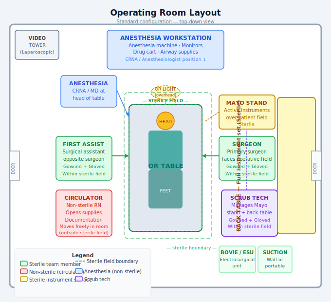

# Chapter 2: The Operating Room Environment

---

## Learning Objectives

By the end of this chapter, the learner will be able to:

1. Describe the physical layout of a typical operating room suite.
2. Identify and explain the three OR traffic zones.
3. Explain environmental controls (temperature, humidity, air exchange) and their purpose.
4. Identify standard OR equipment and its function.
5. Describe fire safety principles in the operating room.

---

## Key Terms

| Term | Definition |
|------|-----------|
| **Unrestricted Zone** | Area of the OR suite where standard hospital attire is acceptable |
| **Semi-restricted Zone** | Area where surgical attire and head covering are required |
| **Restricted Zone** | The OR itself; surgical attire, head covering, and mask are required |
| **Laminar Airflow** | Unidirectional, filtered airflow directed downward over the operative field to reduce contamination |
| **Positive Pressure** | Higher air pressure inside the OR than in adjacent corridors, preventing unfiltered air from entering |
| **HEPA Filter** | High-Efficiency Particulate Air filter used to remove contaminants from OR air |
| **Electrosurgical Unit (ESU)** | Device that uses high-frequency electrical current to cut tissue and achieve hemostasis |
| **C-arm** | Portable fluoroscopy unit used for intraoperative imaging |
| **Boyle's Law** | Relationship between gas pressure and volume; relevant to anesthesia machine function |

---

## 2.1 The Surgical Suite: An Overview

The operating room suite is a self-contained unit within the hospital designed to provide the most controlled, cleanest possible environment for invasive procedures. Everything about its design — from the floor plan to the air handling systems to the material of the walls — exists to reduce the risk of contamination and support the safe delivery of surgical care.

A typical surgical suite includes:
- Individual **operating rooms** (ORs)
- A **scrub sink area** or scrub bays adjacent to each OR
- A **substerile room** (a small supply room between ORs)
- A **clean core** or sterile processing dispatch area
- A **soiled utility room** for contaminated instruments and waste
- A **preoperative holding area** (pre-op)
- A **post-anesthesia care unit (PACU)**
- Staff lounges, changing rooms, and storage corridors

---

## 2.2 Traffic Flow and Zone Classification

The OR suite uses a **three-zone traffic system** to control the movement of personnel and equipment and reduce the risk of cross-contamination.

### Zone 1: Unrestricted Zone
The unrestricted zone includes the entrance to the surgical suite, corridors leading to it, and administrative areas. Standard hospital clothing is acceptable here. Patients on stretchers and family members may be in this zone. No special PPE is required beyond standard precautions.

### Zone 2: Semi-Restricted Zone
The semi-restricted zone includes corridors adjacent to ORs, instrument processing areas, and storage rooms. In this zone:
- Surgical scrub attire (scrubs) must be worn
- All hair must be covered with a surgical cap or hood
- Clean technique is maintained
- Traffic should be purposeful and minimized

### Zone 3: Restricted Zone
The restricted zone is the operating room itself and any directly connected areas (e.g., the scrub sink, substerile room). In this zone:
- Surgical scrub attire is required
- Head and facial hair must be covered
- A surgical mask must be worn when the sterile field is open
- Only necessary personnel may enter
- Conversation and traffic are minimized to reduce airborne contamination

### Traffic Principles
- Traffic in and out of the OR during a case should be minimized. Every time the OR door opens, the pressure differential is disrupted and environmental particles can enter.
- Personnel should not wander between rooms during active cases.
- Doors should remain closed from the establishment of the sterile field until the patient exits the room.

---

## 2.3 Environmental Controls

### Temperature and Humidity
OR temperature is typically maintained between **68°F–75°F (20°C–24°C)**. This range:
- Inhibits bacterial growth (bacteria thrive in warm, moist environments)
- Reduces the metabolic oxygen demand in anesthetized patients
- Supports comfort of gowned surgical team members

**Relative humidity** is maintained between **20%–60%**. Low humidity raises the risk of static electricity, which can ignite volatile anesthetic agents. High humidity promotes microbial growth.

Neonatal and pediatric ORs are often set warmer to compensate for patients' limited thermoregulation.

### Air Exchange and Filtration
The OR is maintained at **positive pressure** relative to adjacent corridors. This means air flows out of the OR when doors open, rather than in — preventing unfiltered corridor air from entering the sterile environment.

OR air handling systems provide:
- A minimum of **20 air exchanges per hour** (typically 15 are fresh outside air)
- Filtration through **HEPA filters** that remove ≥99.97% of particles ≥0.3 microns
- **Laminar airflow** over the operative field in specialty ORs (orthopedic, cardiac), delivering a unidirectional downward stream of filtered air directly over the sterile field to further reduce airborne contamination

---

## 2.4 The Operating Room: Physical Layout

### OR Table
The **operating room table** (also called the surgical table) is the central piece of equipment in any OR. Modern OR tables are:
- Electronically or hydraulically adjustable in height, tilt (Trendelenburg/reverse), lateral tilt (flexion/extension), and break
- Equipped with a removable head section for positioning in certain neurosurgical and ENT cases
- Compatible with numerous attachments: arm boards, stirrups, leg holders, chest rolls, kidney rests, and more

The table must be positioned so the surgeon, scrub tech, and anesthesia provider all have adequate access and sight lines.

### Overhead Surgical Lights
Surgical lights are designed to illuminate the operative field without casting shadows and without generating excessive heat. Modern LED surgical lights are:
- Shadowless (multiple light sources from different angles)
- Adjustable in focus, brightness, and color temperature
- Equipped with **sterile handles** that can be adjusted by the scrubbed team

Light handles are covered with a sterile sleeve and can be positioned by the scrub tech or surgeon without breaking sterility.

### Back Table
The back table is the large, draped, sterile table where all instruments, sutures, and supplies are organized by the scrub technologist before the procedure begins. Back table organization should be logical and consistent — instruments of the same type grouped together, with frequently used items accessible without searching.

### Mayo Stand
The **Mayo stand** is a smaller, height-adjustable tray table positioned directly over the patient (or at the end of the table near the operative field). It holds the instruments that will be used most frequently and immediately during the current step of the procedure. The scrub tech loads the Mayo stand with only what is currently needed and refreshes it as the case progresses.

### Anesthesia Machine
The anesthesia workstation sits at the head of the OR table. It includes:
- Ventilator (delivers controlled breaths)
- Vaporizer (introduces volatile anesthetic agents into the breathing circuit)
- Gas supply connections (O₂, N₂O, air)
- Monitoring equipment (ECG, SpO₂, EtCO₂, blood pressure)
- Drug storage and infusion pumps

The scrub tech does not interact directly with the anesthesia machine, but must know its location and never disrupt anesthesia lines or equipment.

### Electrosurgical Unit (ESU)
The ESU (also called the "Bovie," after its inventor William Bovie) uses high-frequency alternating electrical current to cut tissue or coagulate bleeding vessels. It is one of the most frequently used devices in the OR. Full coverage is provided in Chapter 8 (Hemostasis).

### Suction
At least one (often two) suction sources are available in every OR. Suction tubing runs from wall-mounted vacuum outlets to a canister, and then to the sterile field via suction tips (e.g., Yankauer, Poole, Frazier). The scrub tech manages the sterile end of the suction tubing.

### Additional Fixed Equipment
| Equipment | Purpose |
|-----------|---------|
| **X-ray view boxes / PACS screens** | Display imaging studies |
| **C-arm / fluoroscopy** | Intraoperative real-time imaging |
| **Microscope** | Magnification for microsurgery (neuro, ENT, ophthalmology) |
| **Laparoscopic tower** | Camera, light source, insufflator, monitor for minimally invasive cases |
| **Robotic system (e.g., da Vinci)** | Robotic-assisted minimally invasive surgery |
| **Cell saver** | Collects and reinfuses patient's own blood |
| **Tourniquet** | Controls blood flow to extremity during orthopedic procedures |
| **Nerve stimulator** | Monitors nerve integrity during at-risk procedures |
| **Warming devices** | Patient warming blankets (e.g., Bair Hugger) to prevent hypothermia |

---

## 2.5 Surgical Attire

All personnel entering the semi-restricted or restricted zones must wear **surgical attire** that reduces the shedding of skin particles (which carry microorganisms) into the environment.

### Standard Surgical Attire
- **Scrub suit** (top and pants): single-use or laundered on-site; should fit closely to minimize skin shedding
- **Surgical cap or hood**: covers all head and facial hair completely
- **Surgical mask**: fluid-resistant; covers nose and mouth; required in restricted zone when sterile field is open
- **Eye protection**: safety glasses or face shield when splash risk is present
- **Shoe covers** (policy varies by institution)

### Attire Rules
- Scrub attire worn outside the surgical suite should be changed before re-entering.
- Jewelry (rings, bracelets, necklaces) that cannot be contained under gloves or attire should be removed.
- Artificial nails and nail polish are prohibited in most surgical settings due to evidence of increased bacterial colonization.
- Personal cell phones are prohibited in the restricted zone during cases.

---

## 2.6 Fire Safety in the Operating Room

The OR contains three elements of the **fire triad**:
1. **Fuel**: drapes, gowns, alcohol-based prep solutions, hair
2. **Oxidizer**: supplemental oxygen and nitrous oxide (enriched oxygen environments near the patient's face)
3. **Ignition source**: ESU (electrocautery), lasers, light cords, defibrillators

OR fires are rare but catastrophic. Every member of the surgical team must know how to prevent and respond to them.

### Prevention
- Allow alcohol-based prep solutions to fully dry (≥3 minutes) before draping or using electrosurgery.
- Keep ESU active tip in a holster when not in use — never leave it on the drapes.
- Minimize oxygen concentration near open flame risks (work with anesthesia to use the lowest effective FiO₂).
- Use laser-resistant drapes and ETTs in laser airway cases.

### Response (RACE)
| Step | Action |
|------|--------|
| **R — Rescue** | Remove the patient from immediate danger |
| **A — Alarm** | Activate the fire alarm; call for help |
| **C — Contain** | Close doors to limit fire spread |
| **E — Extinguish/Evacuate** | Extinguish if safe to do so; evacuate if not |

If a fire occurs on the sterile drapes:
1. Remove burning drapes immediately
2. Cut/remove oxygen if near face
3. Smother with saline or CO₂ extinguisher
4. Alert the team

---

## Clinical Pearls

> "An organized room is a safe room. Chaos is a risk factor."

- Before your first patient of the day, walk the room. Know where every piece of equipment is. Know how the OR table works. Know where the fire extinguisher is. Know how to reach the charge nurse.
- Keep OR doors closed during cases — every opening disrupts the pressure differential and increases contamination risk.
- If you are unsure about equipment function, ask before the case begins — not during a crisis.

---

## Review Questions

1. What are the three OR traffic zones, and what attire is required in each?
2. Why is the OR maintained at positive pressure relative to surrounding corridors?
3. What is the recommended air exchange rate for an operating room?
4. What is the purpose of laminar airflow, and in which types of ORs is it most commonly used?
5. Describe the components of the fire triad and give one example of each in the OR setting.
6. What is the RACE protocol, and when is it used?
7. Explain the difference between the back table and the Mayo stand.

---

*[Next: Chapter 3 — Microbiology and Infection Control](Chapter_03_Microbiology_Infection_Control.md)*
