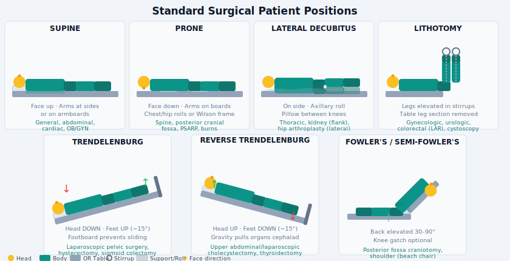

# Chapter 10: Patient Positioning

---

## Learning Objectives

By the end of this chapter, the learner will be able to:

1. Identify the major surgical positions and their indications.
2. Describe equipment and accessories used for positioning.
3. Identify pressure points and potential complications associated with each position.
4. Explain the physiological effects of positioning on circulation and respiration.
5. Describe special considerations for vulnerable patient populations.

---

## Key Terms

| Term | Definition |
|------|-----------|
| **Supine** | Lying flat on the back |
| **Prone** | Lying face down |
| **Lateral** | Lying on the side |
| **Lithotomy** | Supine with hips flexed, legs elevated and abducted in stirrups |
| **Trendelenburg** | Head-down tilt; legs elevated above the head |
| **Reverse Trendelenburg** | Head-up tilt; head above the feet |
| **Fowler's (sitting)** | Semi-recumbent or upright; various degrees of head elevation |
| **Jackknife (Kraske)** | Prone with hips flexed at break of OR table; buttocks elevated |
| **Pressure injury** | Tissue damage from sustained pressure compromising blood flow |
| **Compartment syndrome** | Increased pressure within a muscle compartment leading to ischemia |

---

## 10.1 Principles of Surgical Positioning

Positioning the patient for surgery is a team effort requiring careful planning before the patient arrives in the OR. The goals of surgical positioning are to:

1. **Provide optimal access** to the operative site for the surgeon
2. **Maintain patient safety** throughout the procedure
3. **Protect neurovascular structures** from stretch, compression, or ischemia
4. **Preserve respiratory and cardiovascular function**
5. **Maintain patient dignity**

Improper positioning can result in catastrophic, permanent injury: peripheral nerve damage, compartment syndrome, pressure necrosis, vision loss, or cardiovascular compromise. Every member of the surgical team shares responsibility for safe positioning.

### The Safety Check Before Positioning
- Confirm the procedure and position on the surgical schedule
- Identify patient-specific risk factors: obesity, diabetes, vascular disease, prior surgeries, joint limitations, history of DVT
- Verify all positioning equipment is available and functional
- Review the surgeon's preference card for any specific positioning requirements
- Plan the position before the patient is anesthetized — repositioning after induction is more difficult and riskier

---

## 10.2 Positioning Accessories and Equipment

| Equipment | Purpose |
|-----------|---------|
| **Arm board** | Supports the extended arm; must be padded; abduction limited to ≤90° |
| **Padded stirrups** | Support legs in lithotomy position (candy cane, Allen stirrups, knee crutch) |
| **Bean bag positioner** | Vacuum-hardened foam that conforms to body contours; secures lateral position |
| **Chest rolls (bolsters)** | Placed under the chest in prone position; allow chest expansion |
| **Axillary roll** | Padded roll placed under the axilla in lateral position to offload the dependent shoulder |
| **Kidney rest (flank rest)** | Elevates the flank in lateral position for kidney procedures |
| **Headrest** | Supports the head; multiple designs (donut, Mayfield pins, horseshoe) |
| **Padded footboard** | Prevents foot drop and plantarflexion pressure in prolonged supine cases |
| **Safety strap (leg strap)** | Secures patient to the OR table; applied 2 inches above the knees |
| **Wilson frame** | Convex frame that flexes the spine; used in prone spinal procedures |
| **Laminectomy frame (Relton-Hall)** | Four-post frame supporting chest and iliac crests in prone spinal cases |

All bony prominences and pressure points must be padded prior to draping.

---

## 10.3 Surgical Positions

### Supine (Dorsal Recumbent)

**Description:** Patient lies flat on their back; arms may be at the side or extended on arm boards.

**Used for:** General abdominal surgery, gynecologic surgery (with modification), open heart surgery, lower extremity surgery, most head and neck procedures.

**Pressure points to pad:**
- Occiput (back of head)
- Scapulae
- Olecranon (elbow)
- Sacrum/coccyx
- Heels

**Common complications:**
- Brachial plexus injury from arm hyperabduction (>90°)
- Ulnar nerve injury from pressure on medial elbow
- Heel pressure injuries in prolonged cases
- Lumbar back pain (loss of normal lordosis)

**Physiological effects:** Most physiologically neutral position; baseline for comparison.

---

### Prone

**Description:** Patient lies face-down; chest and iliac crests supported on rolls or frames; head turned or in neutral position on padded headrest.

**Used for:** Posterior spinal surgery, posterior cranial fossa surgery, rectal surgery, posterior extremity procedures.

**Pressure points to pad:**
- Forehead and chin (if face-down)
- Breasts/nipples (female patients)
- Male genitalia (must hang free)
- Iliac crests
- Knees
- Dorsum of feet

**Turning the patient prone:** A coordinated team effort.
- Anesthesia manages the airway throughout the turn
- At minimum 4 persons for turning (one per extremity/body segment + anesthesia at the head)
- Log-roll or Jackson table transfer
- Always confirm ETT position after turning

**Complications:**
- Airway compromise/accidental extubation during turn
- Pressure on the eyes → ischemic optic neuropathy (devastating)
- Abdominal compression → impaired ventilation
- Brachial plexus injury (arms tucked at sides or extended overhead)
- Penile/genital compression (males)

---

### Lateral (Lateral Decubitus)

**Description:** Patient lies on either side; lower arm extended on arm board; upper arm supported on a padded arm sled or pillow; axillary roll placed under lower chest wall.

**Used for:** Thoracic surgery (lung), kidney surgery (nephrectomy), hip arthroplasty (lateral approach), lateral spine procedures.

**Pressure points to pad:**
- Down-side ear
- Shoulder of dependent arm
- Down-side ribs
- Iliac crest (dependent)
- Medial knee (bones of opposing knees contact each other)
- Down-side ankle

**Critical detail — axillary roll:** The axillary roll is placed just below (caudal to) the axilla, not in it. Its purpose is to protect the neurovascular bundle of the dependent arm from compression against the table. If placed incorrectly in the axilla, it will cause injury.

**Stability:** Use a beanbag positioner, kidney rests, or a lateral positioner/rail system. Confirm stability by gently rocking the table before draping.

---

### Lithotomy

**Description:** Patient lies supine; hips are flexed; legs are raised and held in stirrups with knees slightly flexed and hips abducted. Buttocks are at or just past the table break.

**Used for:** Vaginal, perineal, rectal, and combined abdominal/perineal procedures; urologic endoscopy; some laparoscopic gynecologic cases.

**Positions legs simultaneously** to avoid lumbar injury — two persons raise and lower both legs at the same time, in synchrony.

**Stirrup types:**
- **Candy cane**: simple hook; puts more stress on ankle and hip
- **Allen/knee-in-arm (Yellow Fin)**: padded knee support; distributes leg weight along thigh; preferred for most cases
- **Knee crutch**: supports knee; allows some leg extension

**Pressure points to pad:**
- Sacrum and coccyx (bottom of pelvis on table)
- Popliteal fossa (back of knee — peroneal nerve)
- Heels and ankles

**Complications:**
- **Compartment syndrome** of the lower legs — the most feared complication; caused by sustained elevation of legs above heart level → venous engorgement → tissue pressure; risk increases with case duration >3–4 hours
- **Common peroneal nerve injury** from pressure at the fibular head (foot drop)
- **Femoral nerve injury** from excessive hip flexion
- **Hip dislocation** in patients with prior hip replacement

**Duration limit:** Many surgeons aim to stay under 3 hours in full lithotomy. If anticipated duration is longer, discuss with the team and consider intermittent repositioning.

**Lowering legs after lithotomy:** Lower both legs simultaneously and slowly to prevent sudden blood pressure drop from venous redistribution.

---

### Trendelenburg

**Description:** Supine with the head tilted down; feet elevated above the head.

**Used for:** Lower abdominal/pelvic surgery (gravity displaces bowel out of pelvis), laparoscopic procedures (improves pelvic exposure), central venous catheter placement, some vascular procedures.

**Physiological effects:**
- Increases venous return → increased cardiac preload
- Increases intracranial and intraocular pressure
- Displaces diaphragm cephalad → reduces FRC, increases work of breathing

**Complications:**
- Increased ICP (contraindicated in elevated ICP)
- Brachial plexus stretch (shoulder braces should not be used; anti-slip mattress preferred)
- Retinal detachment in susceptible patients with prolonged steep Trendelenburg
- Edema of head/neck

---

### Reverse Trendelenburg

**Description:** Supine with the head elevated; feet below the head.

**Used for:** Head and neck surgery, laparoscopic upper GI procedures (displaces bowel inferiorly), thyroid surgery, bariatric surgery.

**Physiological effects:** Improves respiratory mechanics; reduces intracranial pressure; decreases venous return → may cause hypotension.

**Complications:**
- Hypotension (venous pooling in lower extremities)
- Footboard pressure (pad thoroughly)

---

### Fowler's / Semi-Fowler's (Beach Chair)

**Description:** Head of the OR table elevated to 30°–90°; patient essentially sitting upright.

**Used for:** Shoulder surgery (beach chair position for arthroscopy), craniotomies, some ear and neck procedures.

**Complications:**
- **Venous air embolism (VAE)** — surgical site is above the heart; negative venous pressure can pull air into open veins → air lock in the right heart → cardiac arrest. Monitor with Doppler; treat by flooding the field with saline, positioning in left lateral Trendelenburg.
- Hypotension from venous pooling
- Cervical hyperextension (protect the cervical spine)

---

### Jackknife (Kraske)

**Description:** Prone with the table flexed at the middle ("broken" like a jackknife); buttocks are elevated as the highest point.

**Used for:** Anal and rectal procedures (hemorrhoidectomy, pilonidal cyst excision, anal fistula repair).

Pressure points: same as prone position; additional padding for knees and abdomen at the flexion point.

---

## 10.4 Special Positioning Considerations

### Obese Patients
- Longer extremities and heavier limbs increase torque at joints → greater risk of positioning injuries
- May require extra arm board extensions, additional padding
- Increased risk of respiratory compromise in Trendelenburg → steep angles may not be tolerated
- Pressure injury risk higher due to poor tissue perfusion in adipose tissue

### Pediatric Patients
- Less able to maintain normothermia (higher surface area-to-volume ratio) → add warming measures
- Smaller pressure points still at risk — pad diligently
- Fragile bones and underdeveloped joints → gentle, careful positioning

### Elderly Patients
- Reduced skin turgor and poor perfusion → pressure injuries develop faster
- Joint stiffness and limited range of motion → do not force positions; know the patient's limitations
- Osteoporosis → fracture risk during repositioning

### Patients with Implants
- Existing metal implants may contraindicate certain positions or imaging modalities
- Hip/knee prostheses limit lithotomy positioning — confirm with the surgeon and the patient's history before positioning

---

## Clinical Pearls

> "A position that causes nerve damage takes seconds to create and months to recover from — if ever."

- Before draping, do a final visual sweep: is everything padded? Arms in neutral? No pressure on eyes? ETT still secure?
- In lithotomy position, slide your fingers behind the patient's knee to ensure the popliteal fossa is not resting on the stirrup edge.
- Document position, padding, duration, and any noted concerns at the end of every case.

---

## Review Questions

1. What are the five goals of surgical positioning?
2. Identify the pressure points in the supine position and what complications are associated with inadequate padding.
3. Describe how to safely turn a patient to the prone position.
4. What is the purpose of the axillary roll in the lateral position? Where is it correctly placed?
5. What is compartment syndrome, and which surgical position puts patients at highest risk?
6. What is the most serious complication of the Fowler's (beach chair) position, and how is it recognized and managed?
7. Why are both legs raised and lowered simultaneously when positioning for lithotomy?
8. Describe two considerations for positioning an obese patient that differ from standard practice.

---

*[Next: Chapter 11 — Skin Preparation and Draping](Chapter_11_Skin_Prep_Draping.md)*
