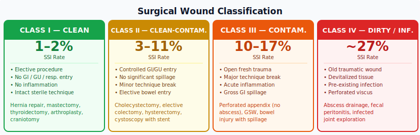
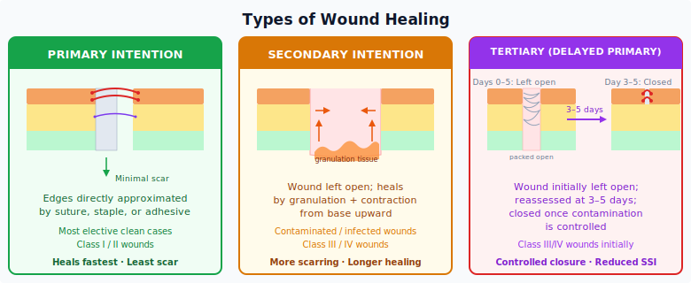

# Chapter 12: The ApC Framework Applied to Every Procedure

---

## Learning Objectives

By the end of this chapter, the learner will be able to:

1. Explain how the ApC framework structures every surgical procedure.
2. Classify surgical wounds by contamination level.
3. Describe the principles of tissue handling that apply across all specialties.
4. Identify the layers of the abdominal wall and their implications for access and closure.
5. Read any procedure in Part II using the Approach → Procedure → Closure structure.

---

## 12.1 The Framework That Never Changes

Every chapter in Part II covers a different surgical specialty with different anatomy, different instruments, and different pathology. But every single procedure in every single chapter follows the same structure:

---

> **THE APPROACH**
> How do you get into the operative field?
> — Position. Prep. Draping. Gown and gloves. The knife (incision). Retractors.

> **THE PROCEDURE**
> What happens once you are inside?
> — Anatomy. Dissection. Operative steps. Instruments. Scrub tech responsibilities.

> **THE CLOSURE**
> How do you get back out?
> — Layer-by-layer closure with specific sutures. Drains. Dressings. Documentation.

---

This is the universal surgical language. A first-year student and a twenty-year veteran walk into the same operating room. The veteran doesn't know more procedures — they know the same procedures more deeply, through the same framework. They can look at any case they have never scrubbed before and immediately begin asking the right questions:

- **Approach:** What position? What prep area? Which drapes? Which blade? Which retractors?
- **Procedure:** What is the anatomy? What are the critical structures? What instruments will be needed at each step?
- **Closure:** How many layers? What suture for each? Is there a drain? What dressing?

That discipline — that structured thinking — is what this section of the book develops.

---

## 12.2 The Approach: Four Constants in Every Case

Regardless of the procedure, the Approach always contains the same four elements. What changes is the specific implementation.

### 1. Draping
Every case creates a sterile field around the operative site by draping. The drape type, configuration, and size change with the case:
- Open abdomen: four towels + laparotomy sheet
- Laparoscopic abdomen: same basic configuration, often with pre-cut port openings
- Extremity: extremity drapes with a free-hanging leg
- Head/neck: head drape + cervical aperture
- Eye: small aperture adhesive ophthalmic drape

But the **principles** are constant: the drapes are sterile, placed from the incision site outward, never repositioned once placed, and define the boundary of the sterile field.

### 2. Gown and Gloves
Every scrubbed team member is gowned and gloved before the field is established. The gown and gloves are the interface between the surgical team and the sterile field. They are uniform across specialties — only the number of scrubbed team members and glove size requirements change.

### 3. The Knife (Initial Incision)
Every surgery requires entry through tissue. The specific knife is:
- A scalpel blade (most common): the blade number, handle number, and incision location are all specific to the case
- A keratome or MVR blade (ophthalmology)
- An electrosurgical device (some approaches begin with ESU instead of cold steel)
- No skin incision at all in endoscopic cases — but there is still an "entry point" (the trocar, the natural orifice, the scope)

The scrub tech must have the correct blade mounted, safely, and immediately available when the surgeon extends their hand.

### 4. Retractors
After entry, tissue must be held out of the way. The retractor system is entirely case-specific:
- Finochietto spreads the sternum in cardiac surgery
- Crowe-Davis opens the mouth in tonsillectomy
- Hohmann hooks surround the acetabulum in hip arthroplasty
- The pneumoperitoneum and trocars replace retractors in laparoscopy
- The phaco machine's irrigation pressure holds the anterior chamber open in cataract surgery

The principle — maintain and widen exposure — is constant. The tool changes every time.

---

## 12.3 Wound Classification

Before the first incision is made in any case, the surgical wound is pre-classified based on the expected degree of contamination. This classification determines antibiotic selection, closure strategy, and documentation.



### The Four Classes

**Class I: Clean**
- Elective surgery; no entry into GI/GU/respiratory tract; no inflammation; no break in sterile technique
- **SSI rate: ~1–2%**
- Examples: hernia repair, mastectomy, thyroidectomy, joint arthroplasty, craniotomy

**Class II: Clean-Contaminated**
- Controlled entry into GI/GU/respiratory tract; no significant spillage; minor sterile technique break
- **SSI rate: ~3–11%**
- Examples: cholecystectomy, elective colectomy (no spillage), hysterectomy, cystoscopy with stent

**Class III: Contaminated**
- Open fresh trauma; major sterile technique break; acute (non-purulent) inflammation; gross GI spillage
- **SSI rate: ~10–17%**
- Examples: perforated appendix (no abscess), gunshot wound, bowel injury with spillage

**Class IV: Dirty / Infected**
- Old traumatic wound with devitalized tissue; existing infection; perforated viscus present pre-surgery
- **SSI rate: ~27%**
- Examples: abscess drainage, fecal peritonitis, infected joint exploration

### Why It Matters to the Scrub Tech
Wound classification directly affects the **Closure**:
- Class I/II: primary closure of all layers
- Class III/IV: fascia closed; subcutaneous and skin left open (packed) for delayed primary closure
- Class IV: consider whether instruments used in the infected field should be isolated from instruments used for closure — a two-table technique or instrument exchange at closure

---

## 12.4 Tissue Handling Principles

Across all specialties, the same core principles protect tissue and promote healing:

| Principle | Application |
|-----------|------------|
| **Handle gently** | Grasp only what is needed; avoid crushing; use atraumatic forceps (DeBakey, Babcock) for bowel and vessels |
| **Preserve blood supply** | Devascularized tissue does not heal; becomes a nidus for infection |
| **Operate in anatomical planes** | Dissection along natural tissue planes is easier, faster, and causes less damage |
| **Maintain hemostasis** | Blood in dead space → hematoma → infection → dehiscence |
| **Eliminate dead space** | Approximate tissue layers to prevent fluid accumulation |
| **Protect structures at risk** | Always visualize before cutting; confirm identity of vessels, nerves, ducts |

---

## 12.5 Dissection Techniques

### Sharp Dissection
Scalpel or scissors divide tissue precisely. Used when planes are not naturally separable, or when clean margins are required (oncologic surgery). Cold steel is more precise than electrocautery.

### Blunt Dissection
Tissue separated by spreading (fingers, Kittner, sponge stick) along natural areolar planes. Kittner dissectors (rolled gauze sponges mounted on a clamp) are the classic blunt dissection tool — **count them carefully; they are small and easily lost in deep wounds**.

### Electrodissection
ESU in cut or blend mode. Efficient; simultaneously coagulates small vessels. More thermal spread than cold steel.

### Combination (Standard Practice)
Most dissection uses all three in sequence: sharp to enter a plane, blunt to develop it, ESU for bleeding vessels.

---

## 12.6 Layers of the Abdominal Wall


Understanding these layers is the foundation for understanding the **Approach** in every abdominal procedure and the **Closure** that follows.

**Anterior abdomen, superficial to deep:**

1. **Skin**
2. **Camper's fascia** (superficial fat)
3. **Scarpa's fascia** (denser deep fascia of the lower abdomen)
4. **External oblique muscle / aponeurosis**
5. **Internal oblique muscle / aponeurosis**
6. **Transversus abdominis muscle / aponeurosis**
7. **Transversalis fascia**
8. **Preperitoneal fat**
9. **Peritoneum**

**In the midline:** the three muscle aponeuroses fuse at the **linea alba** — an avascular fibrous band that provides the cleanest, most bloodless entry into the abdominal cavity.

### Common Abdominal Incisions

| Incision | Location | Structures Divided | Primary Use |
|---------|----------|-------------------|------------|
| **Midline** | Xiphoid to pubis | Skin, subcutaneous, linea alba, peritoneum | General abdominal access |
| **Pfannenstiel** | Low transverse, 2 cm above symphysis | Skin, Scarpa's fascia, anterior rectus fascia (horizontal); rectus muscles separated vertically | Pelvic surgery (C-section, hysterectomy) |
| **Kocher (subcostal)** | Below right costal margin, oblique | Skin, subcutaneous, external/internal oblique, transversus, peritoneum | Liver, biliary |
| **McBurney / Gridiron** | Oblique, RLQ, over McBurney's point | Skin, muscles split in line of their fibers | Open appendectomy |
| **Flank / Retroperitoneal** | Posterior lateral approach | Skin, latissimus dorsi, obliques; retroperitoneum without entering peritoneum | Kidney, adrenal |

---

## 12.7 Types of Wound Healing



**Primary intention (first intention):** Wound edges directly approximated by suture, staples, or adhesive. Minimal gap; heals with minimal scarring. Standard for most elective clean cases.

**Secondary intention:** Wound left open; heals by granulation and contraction from the base upward. Used for contaminated/infected wounds. More scarring; longer healing time.

**Tertiary intention (delayed primary closure):** Wound initially left open (Class III/IV), re-evaluated at 3–5 days, closed once contamination is controlled.

---

## How to Read Part II

Every procedure chapter in Part II is built on the same template:

```
Procedure Name
├── THE APPROACH
│   ├── Position
│   ├── Prep
│   ├── Draping
│   ├── Gown and Gloves
│   ├── The Knife
│   └── Retractors
├── THE PROCEDURE
│   └── Step-by-step operative steps
└── THE CLOSURE
    ├── Layer-by-layer with suture selection
    ├── Drain (if applicable)
    └── Dressing
```

When you scrub a case you have never seen before, read it this way. When you are quizzed on a procedure, organize your answer this way. When you are standing at the back table and the case begins, think this way.

The Approach. The Procedure. The Closure.

Every time.

---

## Review Questions

1. What are the four constant elements of every surgical Approach?
2. Describe the four wound classifications and the approximate SSI rate for each.
3. How does wound classification affect the Closure decision?
4. List the layers of the anterior abdominal wall from superficial to deep.
5. What is the linea alba, and why is it preferred for midline incisions?
6. Describe the difference between primary, secondary, and tertiary wound healing.
7. What is a Kittner dissector, and what special precaution must be observed when using it?
8. Name three types of abdominal incisions and their primary indications.
9. Why should a two-table technique (or instrument exchange) be considered for Class IV wound closures?
10. Describe how the ApC framework helps a scrub tech prepare for a procedure they have never seen.

---

*[Next: Chapter 13 — General Surgery](Chapter_13_General_Surgery.md)*
